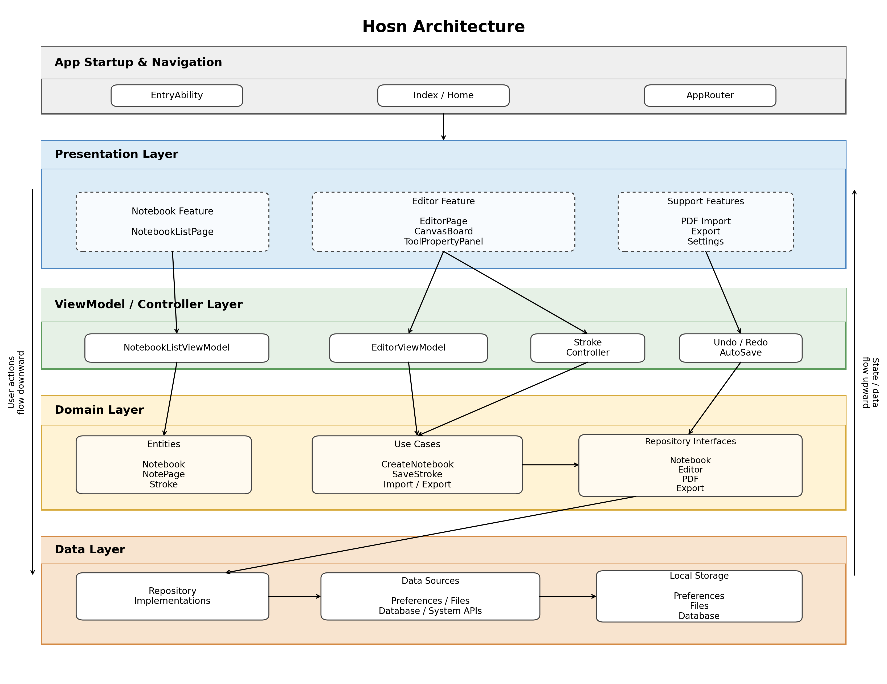

# Hson

[](https://classroom.github.com/a/py413vYq)

Hson is a local-first digital notebook application for HarmonyOS tablets. It helps users create notebooks, write naturally on canvas pages, organize pages, annotate imported PDF materials, and export notes for sharing or submission. The project is built with ArkTS and ArkUI in DevEco Studio, with local persistence for notebook metadata, page canvases, strokes, and inserted elements.

## Key Features

- Notebook management: create, open, rename, delete, sort, and organize notebooks.
- Page management: add pages, delete pages, reorder pages, preview thumbnails, and switch between pages.
- Canvas writing: write with pen, pencil, and highlighter tools, adjust color/width/opacity, erase, undo, redo, and clear content.
- Templates and page sizes: use blank, lined, grid, and dotted page backgrounds, and switch between common paper sizes.
- Inserted content: add text, shapes, and images, then move or resize them on the page.
- PDF import: import PDF documents as notebook pages and write annotations directly on top of the rendered pages.
- Export: export pages or notebooks as PDF or image formats.
- Local persistence: notebooks, pages, canvas metadata, strokes, elements, and user preferences are stored locally.

## Tech Stack

- Platform: HarmonyOS tablet
- Language: ArkTS / TypeScript
- UI framework: ArkUI
- Build tool: Hvigor / DevEco Studio
- Storage: local files and HarmonyOS Preferences
- Testing: TypeScript checks, Vitest unit tests, smoke tests, quality gates, metrics scripts

## Project Structure

```text
entry/src/main/ets/
  app/                    App startup, routing, and initialization
  common/                 Shared constants, theme utilities, geometry helpers
  data/                   Local data sources and repository implementations
  domain/                 Entities, repository interfaces, and use cases
  features/home/          Home page and quick actions
  features/notebook/      Notebook list, import, export, and management UI
  features/editor/        Editor page, canvas board, tools, rendering, selection, undo/redo
tests/                    CI, unit, smoke, quality, and metrics checks
docs/                     Architecture, UI design notes, and screenshots
```

## Installation and Setup

### 1. Clone the repository

```bash
git clone git@github.com:sustech-cs304/team-project-26spring-26s-3.git
cd team-project-26spring-26s-3
```

### 2. Install JavaScript test dependencies

These dependencies are used by the CI and local test scripts.

```bash
npm ci
```

### 3. Open the app in DevEco Studio

1. Install DevEco Studio with HarmonyOS SDK support.
2. Open this repository as a HarmonyOS project.
3. Let DevEco Studio sync the project and download required OHPM/HarmonyOS build dependencies.
4. Select the `entry` module and the `default` product.

### 4. Configure signing

The committed `build-profile.json5.template` is a safe template. Local signing files and passwords should be generated on each developer machine.

In DevEco Studio:

1. Open the project signing configuration.
2. Enable automatic signing or create a debug signing configuration.
3. Generate a valid `.cer`, `.p7b`, and `.p12`.
4. Make sure the generated paths are written to your local `build-profile.json5`.

If the build fails at `:entry:default@SignHap` with a message such as `The certificate has expired`, regenerate the signing certificate in DevEco Studio.

## Running the Application

### Run from DevEco Studio

1. Connect a HarmonyOS tablet or start a compatible HarmonyOS emulator.
2. Select the `entry` module.
3. Click Run.
4. DevEco Studio will build, sign, install, and launch the app.

### Build from the command line

Use the DevEco bundled Node.js and Hvigor wrapper, or run the same command from DevEco Studio's build panel:

```bash
/Applications/DevEco-Studio.app/Contents/tools/node/bin/node \
  /Applications/DevEco-Studio.app/Contents/tools/hvigor/bin/hvigorw.js \
  --mode module \
  -p module=entry@default \
  -p product=default \
  -p requiredDeviceType=tablet \
  assembleHap
```

The generated HAP is produced by the HarmonyOS build pipeline after compilation, packaging, and signing complete successfully.

## Usage Examples

### Create and write in a notebook

1. Launch Hson.
2. Create a new notebook from the notebook list page.
3. Open the notebook to enter the editor.
4. Select a pen, pencil, or highlighter.
5. Write on the canvas with a stylus or touch input.
6. Use undo, redo, erase, or clear when needed. Content is saved locally.

### Manage pages

1. Open an existing notebook.
2. Use the page sidebar to create a new page.
3. Drag or use page actions to reorder pages.
4. Change the page template to blank, lined, grid, or dotted.
5. Switch page size when a different paper layout is needed.

### Import and annotate a PDF

1. From the notebook area, choose the import action.
2. Pick a local PDF file.
3. The PDF is converted into notebook pages with rendered backgrounds.
4. Open the imported notebook.
5. Write annotations directly over the PDF pages.
6. Export the annotated notebook as PDF when finished.

### Insert richer content

1. Open a notebook page.
2. Choose text, shape, or image tools.
3. Insert the element on the canvas.
4. Move, resize, or edit the inserted element as needed.

## Development and Testing

Run the local checks before submitting changes:

```bash
npm run test:typecheck
npm run test:quality
npm run test:smoke
npm run test:coverage
```

Additional project metrics and CI helper scripts are available:

```bash
npm run metrics
npm run metrics:scc
npm run quality:cpd
npm run test:ohos
```

The combined CI command is:

```bash
npm run test:ci
```

## Architecture

Hson uses a layered architecture with an MVVM-style presentation layer and repository-based persistence.



At a high level:

- ArkUI pages and components handle user interaction.
- ViewModels coordinate UI state and business operations.
- Domain entities and use cases describe core notebook, page, canvas, stroke, and tool concepts.
- Repository implementations persist notebook metadata, page content, canvas information, and preferences locally.

See [design-26s-3.md](design-26s-3.md) and [docs/report.md](docs/report.md) for more architecture and UI design details.

## Known Issues and Limitations

- The app is designed primarily for HarmonyOS tablet usage; phone layouts are not the main target.
- Data is local-first. Cloud sync, account login, and multi-device collaboration are not currently implemented.
- Signing certificates are local developer artifacts. Expired or missing certificates will prevent HAP signing.
- Some HarmonyOS APIs used by the project may show deprecation warnings depending on the installed SDK version.
- PDF import quality depends on the source PDF and the platform PDF rendering APIs.

## Additional Documents

- [Proposal](proposal-26s-3.md)
- [Design Document](design-26s-3.md)
- [Architecture and UI Report](docs/report.md)
- [CI/CD Notes](docs/cicd.md)
