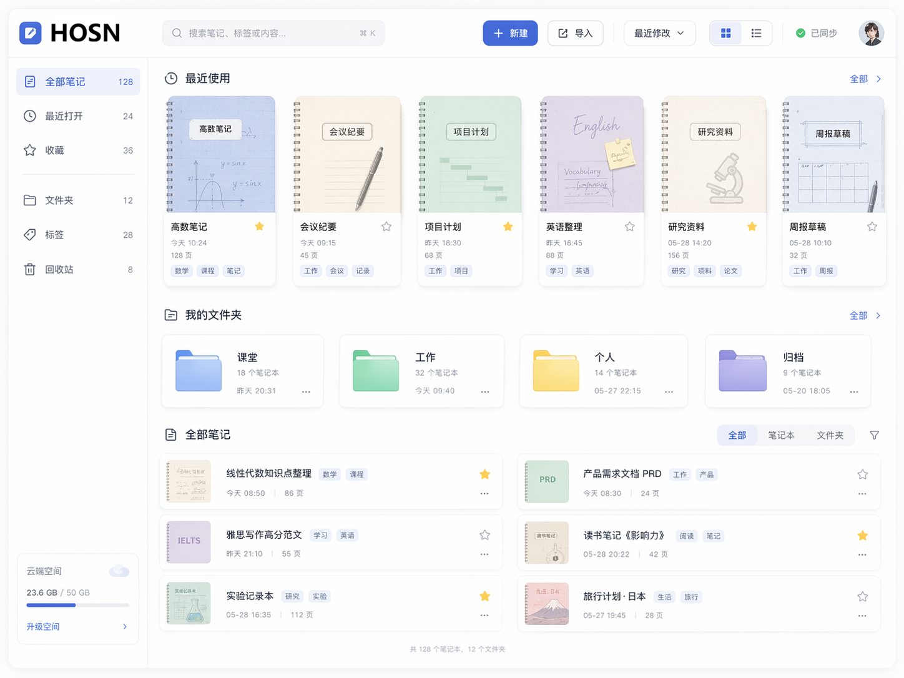
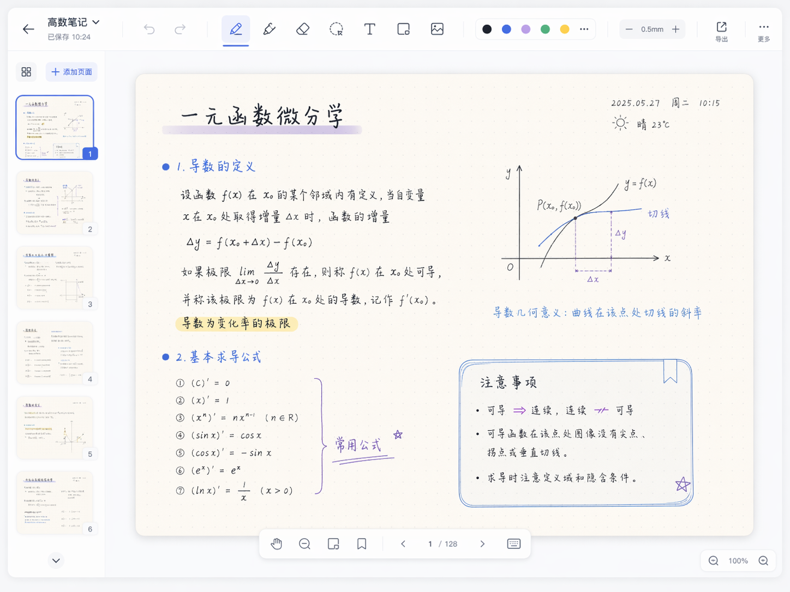

# Hson 设计文档

## 1. Architectural Design

### 1.1 架构图

下图展示了我们团队项目的整体软件架构。

### 1.2 架构描述

该项目是一个面向 HarmonyOS 平板的数字笔记应用，核心功能包括笔记本管理、手写与绘图编辑、PDF 导入导出以及本地持久化。为了更清晰地组织这些功能，我们采用了分层架构，并将系统划分为以下五个部分：

1. **App Startup & Navigation**
2. **Presentation Layer**
3. **ViewModel / Controller Layer**
4. **Domain Layer**
5. **Data Layer**

下面分别对这些层进行说明。

#### （1）App Startup & Navigation

这一层负责应用启动和页面导航，包括 `EntryAbility`、`Index / Home` 和 `AppRouter`。

- `EntryAbility` 负责应用入口与生命周期管理。
- `Index / Home` 表示应用启动后的初始页面。
- `AppRouter` 用于管理页面之间的跳转关系。

这一层只负责应用启动流程和页面组织，不直接处理具体业务逻辑。

#### （2）Presentation Layer

这一层负责界面展示和用户交互，主要分为三个功能区域：

- **Notebook Feature**：负责笔记本列表展示和笔记本管理。
- **Editor Feature**：负责编辑器主页面、画布区域和工具属性面板。
- **Support Features**：负责 PDF 导入、导出以及设置等辅助功能。

这一层主要解决“如何展示”和“如何接收用户操作”的问题，不直接承担底层数据访问逻辑。

#### （3）ViewModel / Controller Layer

这一层位于界面层和业务层之间，主要负责状态管理和交互逻辑组织。

- `NotebookListViewModel` 负责笔记本列表页面的状态管理。
- `EditorViewModel` 负责编辑器整体状态管理。
- `Stroke Controller` 负责书写与绘图过程中的笔迹处理。
- `Undo / Redo AutoSave` 负责撤销、重做和自动保存等行为。

将这些逻辑从页面中拆分出来，可以降低页面复杂度，也使编辑器相关功能更加清晰。

#### （4）Domain Layer

这一层负责系统的核心业务逻辑，主要由三部分组成：

- **Entities**：定义系统中的核心对象，例如 `Notebook`、`NotePage` 和 `Stroke`。
- **Use Cases**：描述系统提供的关键业务能力，例如 `CreateNotebook`、`SaveStroke` 和 `Import / Export`。
- **Repository Interfaces**：提供抽象的数据访问接口，例如 Notebook、Editor、PDF 和 Export 相关接口。

这一层关注的是“系统要完成什么”，而不是界面如何呈现或数据如何具体存储。

#### （5）Data Layer

这一层负责具体的数据访问和持久化实现，包括：

- **Repository Implementations**：对领域层中仓储接口的具体实现。
- **Data Sources**：具体的数据来源，例如 Preferences、文件系统、数据库和系统 API。
- **Local Storage**：最终的数据存储位置，包括 Preferences、Files 和 Database。

也就是说，业务层通过接口提出数据需求，而数据层负责完成真正的数据读写与持久化操作。

### 1.3 为什么采用这种架构

之所以采用这种架构，是因为本项目不仅包含页面展示和导航，还涉及手写绘图、笔迹保存、PDF 导入导出以及本地持久化等多种功能。如果把这些逻辑全部放在页面中实现，会使系统耦合度较高，也不利于后续维护和扩展。

通过分层设计，我们可以把界面逻辑、业务逻辑和数据访问逻辑分离开来，使系统结构更清晰，也更便于后续开发。

### 1.4 设计假设

这张图中存在的设计假设有：

- 当前系统采用 **local-first** 的思路，数据主要保存在本地设备上，而不是依赖远程服务器。
- 编辑器中的复杂行为，例如笔迹处理、撤销重做和自动保存，被有意识地从页面层中分离出来，以避免页面承担过多职责。
- 当前架构为后续扩展预留了空间，例如未来如果要加入云同步或更多高级编辑功能，不需要完全推翻现有结构。

---

## 2. UI Design

在正式实现界面之前，我们先对系统的主要用户界面进行了设计。这些内容用于指导后续实现，并帮助团队成员在开发前就界面布局和功能入口达成一致。这里展示的是 UI 设计结果，而不是最终实现截图。

### 2.1 主要界面一：笔记本列表 / 首页

- 笔记本列表或系统首页；
- 提供新建、打开和管理笔记本等入口。

### 2.2 主要界面二：编辑器页面

- 主要编辑界面；
- 包括画布区域、工具栏和工具属性面板等核心部分。

### 2.4 UI 设计说明

以上图片用于展示系统主要界面的布局和设计思路，它们与实现后的实际界面截图不同。UI 设计的目的在于帮助团队在开发前明确界面结构、主要功能入口以及基本交互方式，从而为后续实现提供统一参考。
